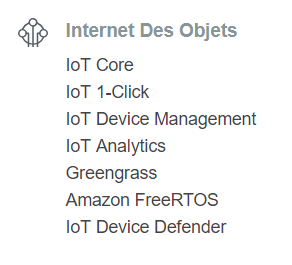

# AWS IoT

- [aws.amazon.com/iot/](https://aws.amazon.com/fr/iot/)

AWS IoT is a platform to easily manage “Internet of Things” devices, also called “things”, permitting them to interact with each other. 
Much like any AWS service, AWS IoT can connect to other AWS cloud applications such as [Lambda](../Lambda). 
Any AWS IoT supported device such as a Raspberry Pi or an AWS IoT Button can be connected to the cloud. In this tutorial, 
we will be creating a virtual device in a computer.

## AWS IoT Device SDK for JavaScript

- [Ressources AWS IoT Core – Amazon Web Services](https://aws.amazon.com/fr/iot-core/resources/)
- [aws/aws-iot-device-sdk-js: SDK for connecting to AWS IoT from a device using JavaScript/Node.js](https://github.com/aws/aws-iot-device-sdk-js/blob/master/README.md)
- [Using the AWS IoT Device SDK for JavaScript - AWS IoT](https://docs.aws.amazon.com/iot/latest/developerguide/iot-device-sdk-node.html)

## IoT Button

- [AWS IoT Button](https://aws.amazon.com/fr/iotbutton/)
- [Dash Button : Amazon.fr](https://www.amazon.fr/Dash-Button-Amazon/b?ie=UTF8&node=10909388031)
- [Démarrage rapide du bouton AWS IoT - AWS IoT](https://docs.aws.amazon.com/fr_fr/iot/latest/developerguide/iot-button-lambda.html)

 ## Use cases

- [NodeJs Connect AWS-IOT Device with JS SDK | Codementor](https://www.codementor.io/mohdraheem06/nodejs-connect-aws-iot-device-with-js-sdk-jevizuihr)
