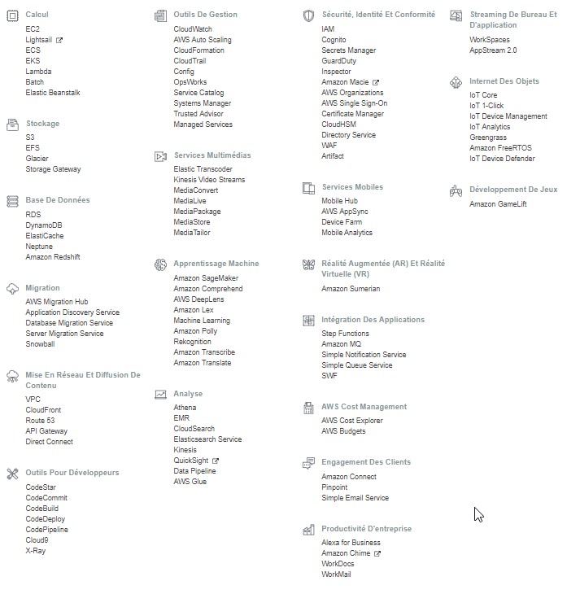

# AWS

Services:

- [CloudSearch](./CloudSearch)
- [CloudWatch](./CloudWatch)
- [CodePipeline](./CodePipeline)
- [EC2](./EC2)
- [Elastic Beanstalk](./ElasticBeanstalk)
- [IoT](./IoT)
- [Lambda](./Lambda): Exécutez du code sans vous soucier des serveurs. Payez uniquement pour le temps de calcul consommé.
- [S3](./S3)
- [SNS](./SNS) (_Simple Notification Service_): Service de messagerie pub/sub entièrement géré pour les microservices, les systèmes décentralisés et les applications sans serveur.
- [SQS](./SQS) (_Amazon Simple Queue Service_): Service de file d'attente de messagerie entièrement géré pour les microservices, les systèmes décentralisés et les applications sans serveur.

